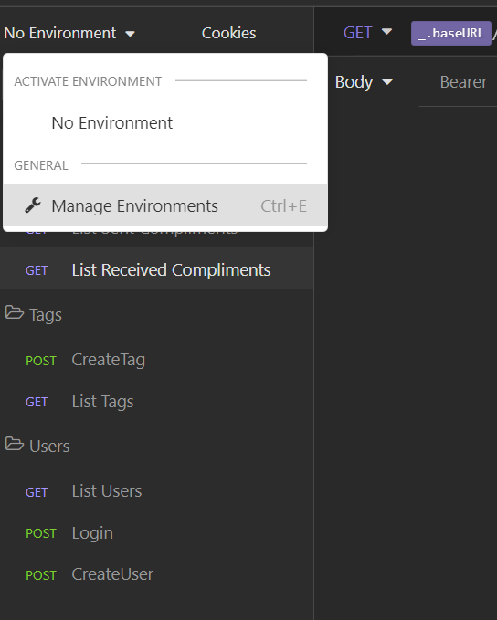

# nlw-elogia

##  O projeto

*   A ideia do projeto é permitir que os usuários façam elogios a outros através dessa API.

## A Stack

*   Projeto Node.js usando TypeScript.
*   PostgreSQL para o BD (no projeto original é usado SQLite)

## O Banco de Dados
O banco de dados está organizado da seguinte maneira:

##  Start no projeto

Para rodar o projeto na sua maquina faça o clone do projeto e siga os passos:

*   Criar um Banco de dados PostgreSQL:
    *    fazer uma copia do arquivo 'ormconfig.example.json' e mudar para 'ormconfig.json' e alterar os dados de conexão para funcionar com o seu banco de dados;

*   rodar o comando: 'yarn' para instalar as dependencias

*   rodar o comando: 'yarn typeorm migration:run' para realizar as migrations do Banco de dados

* Criar uma copia do arquivo .example.env e mudar o nome para .env
  * Adicionar um token para o gerar o jwt e Colocar a porta que deseja rodar a aplicação.

*   rodar o comando: 'yarn dev' para rodar a aplicação como desenvolvedor.

* Se decidir testar as rotas através do Insomnia, há um arquivo (nome do arquivo: Insomnia_Json_Routes.json) com as rotas cadastradas e informações para poder fazer os testes. 

* Para importar o arquivo vá no Insomnia e clique em: 'Create > Import from File'

* Lembre-se de alterar as variaveis da porta e token (após fazer Login) em 'Manage Environments'.

